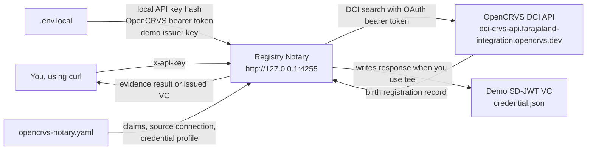
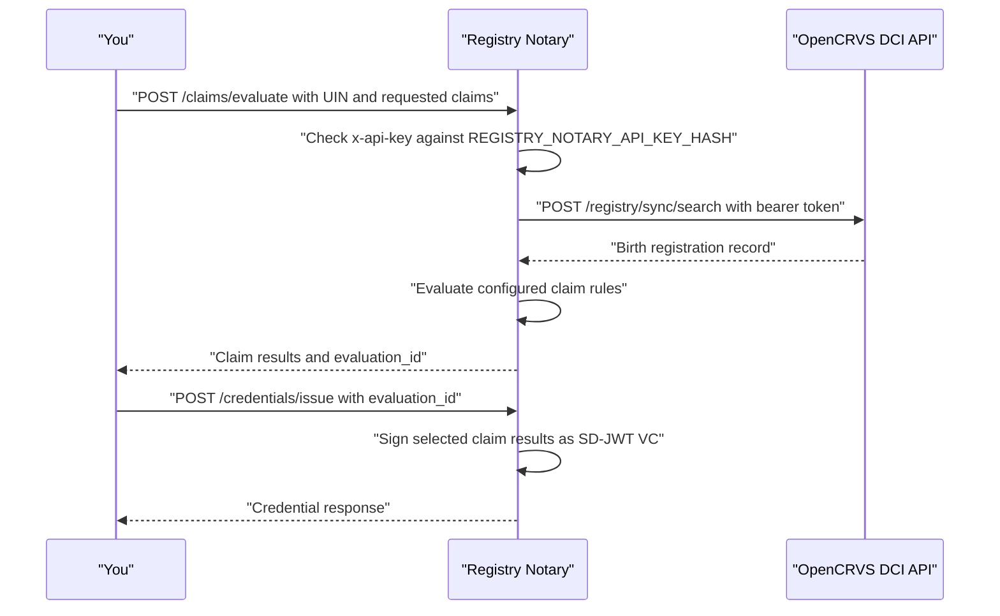

# OpenCRVS DCI Standalone Tutorial

This tutorial starts from zero: you want to get a `registry-notary` binary,
run it locally, connect it to the OpenCRVS DCI API, evaluate evidence, and
issue a demo SD-JWT VC.

## What You Will Run

You will start Registry Notary locally:

```text
http://127.0.0.1:4255
```

Registry Notary will call OpenCRVS:

```text
https://dci-crvs-api.farajaland-integration.opencrvs.dev
```

You will test four evidence claims:

- `opencrvs-birth-record-exists`
- `opencrvs-date-of-birth`
- `opencrvs-sex`
- `opencrvs-age-band`

Then you will issue a demo SD-JWT VC with:

```text
opencrvs_birth_summary_sd_jwt
```

This tutorial uses demo machine-to-machine issuance. It does not create a
citizen-wallet-bound credential.

## How The Pieces Fit Together

There are two HTTP relationships in this tutorial.

First, you call Registry Notary on your own machine. Registry Notary protects
that local API with an `x-api-key` header so only a caller with the demo API key
can ask it to evaluate evidence or issue a credential.

Second, Registry Notary calls OpenCRVS. OpenCRVS protects its DCI API with an
OAuth client token. You fetch that token with your OpenCRVS client id and client
secret, then Registry Notary uses the token when it searches OpenCRVS.

The shape looks like this:



Registry Notary is the translator. You ask it a claim question like "does a
birth record exist for this UIN?" Registry Notary turns that into an OpenCRVS
DCI search, reads the returned record, evaluates the configured claims, and can
package the selected claim results into a verifiable credential.

## Before You Start

Install:

- Docker Desktop is not required for this standalone tutorial
- Git
- Rust and Cargo
- OpenSSL
- `curl`
- `jq`

Check:

```bash
git --version
cargo --version
openssl version
curl --version
jq --version
```

If you already received a built `registry-notary` binary, you can skip Step 1
after checking:

```bash
registry-notary --help
```

If you have any doubt about the binary, build it in Step 1. Older builds do not
understand the OpenCRVS DCI request shape used in this tutorial.

## Step 1: Get Registry Notary

The safest path is to build Registry Notary from source. The build expects three
repositories beside each other:

```text
work/
  registry-notary/
  registry-platform/
  cel-mapping/
```

Create that layout:

```bash
mkdir -p work
cd work

git clone https://github.com/jeremi/registry-notary.git
git clone https://github.com/jeremi/registry-platform.git
git clone https://github.com/PublicSchema/crosswalk.git cel-mapping
```

If you received source folders instead of cloning from GitHub, unpack or rename
them so the folder names match the layout above.

Build the `registry-notary` command:

```bash
cd registry-notary
cargo build --release -p registry-notary-bin
export PATH="$PWD/target/release:$PATH"
registry-notary --help
```

Keep this terminal open. The `PATH` change applies only to this terminal.

For this tutorial, OpenCRVS-compatible means the binary can:

- read `dci.registry_event_type` from the YAML config
- send `reg_event_type: birth` to OpenCRVS
- send `pagination.page_number: 1` to OpenCRVS
- read records from `/message/search_response/0/data/reg_records`

You do not need to inspect the code to confirm this. The config in Step 5,
startup in Step 6, and evidence request in Step 9 are the practical checks.

## Step 2: Create A Working Folder

The working folder keeps the demo config, local secrets, and output credential
in one place. Nothing in this folder needs to be committed to Git.

```bash
mkdir -p "$HOME/opencrvs-notary-demo"
cd "$HOME/opencrvs-notary-demo"
```

Everything in this tutorial will live in this folder.

## Step 3: Create Local Values

This tutorial uses three kinds of values:

- OpenCRVS credentials, supplied by the OpenCRVS environment owner
- a local Registry Notary API key, generated by you for calls to
  `http://127.0.0.1:4255`
- a demo issuer key, included only so the tutorial can issue a local SD-JWT VC

Registry Notary does not store the plaintext local API key in its config. It
stores a SHA-256 fingerprint of the API key. That is where
`REGISTRY_NOTARY_API_KEY_HASH` comes from.

Set your OpenCRVS OAuth client values first. Replace both `paste-...-here`
values before running this command:

```bash
OPENCRVS_DCI_CLIENT_ID='paste-client-id-here'
OPENCRVS_DCI_CLIENT_SECRET='paste-client-secret-here'
```

Generate the local Registry Notary API key and its fingerprint:

```bash
REGISTRY_NOTARY_API_KEY="$(openssl rand -hex 32)"
REGISTRY_NOTARY_API_KEY_HASH="$(
  printf '%s' "$REGISTRY_NOTARY_API_KEY" |
    openssl dgst -sha256 -r |
    awk '{print "sha256:" $1}'
)"
REGISTRY_NOTARY_AUDIT_HASH_SECRET="$(openssl rand -hex 32)"
```

Now write `.env.local`:

```bash
cat > .env.local <<EOF
OPENCRVS_DCI_BASE_URL=https://dci-crvs-api.farajaland-integration.opencrvs.dev
OPENCRVS_DCI_CLIENT_ID='$OPENCRVS_DCI_CLIENT_ID'
OPENCRVS_DCI_CLIENT_SECRET='$OPENCRVS_DCI_CLIENT_SECRET'

REGISTRY_NOTARY_API_KEY='$REGISTRY_NOTARY_API_KEY'
REGISTRY_NOTARY_API_KEY_HASH='$REGISTRY_NOTARY_API_KEY_HASH'
REGISTRY_NOTARY_AUDIT_HASH_SECRET='$REGISTRY_NOTARY_AUDIT_HASH_SECRET'

# Demo-only issuer key. It is public test material for this tutorial.
# Replace it before anything beyond a local smoke test.
REGISTRY_NOTARY_ISSUER_JWK='{"kty":"OKP","crv":"Ed25519","d":"2oPoxdKuO7Kpd-3JLfNW_4xwpFxItbS-fxe03ZybYEw","x":"1aj_rLJsGFgw-5v925EMmeZj5JqP44xegafEKfZbdxc","alg":"EdDSA"}'
EOF
chmod 600 .env.local
```

Check the file without printing secrets:

```bash
set -a
source ./.env.local
set +a

test -n "$OPENCRVS_DCI_CLIENT_ID" && echo "OpenCRVS client id loaded"
test -n "$REGISTRY_NOTARY_API_KEY" && echo "Local API key loaded"
test -n "$REGISTRY_NOTARY_API_KEY_HASH" && echo "Local API key hash loaded"

if [ "$OPENCRVS_DCI_CLIENT_ID" = "paste-client-id-here" ]; then
  echo "Replace OPENCRVS_DCI_CLIENT_ID before continuing"
fi
if [ "$OPENCRVS_DCI_CLIENT_SECRET" = "paste-client-secret-here" ]; then
  echo "Replace OPENCRVS_DCI_CLIENT_SECRET before continuing"
fi
```

Do not commit `.env.local` or paste it into chat, tickets, or screenshots.

The OpenCRVS SHA secret is not used in this tutorial. The current OpenCRVS DCI
test API accepts unsigned DCI search requests. If that environment starts
requiring signed DCI requests, Registry Notary will need DCI request signing
configuration before this tutorial can work unchanged.

The demo issuer key is not an OpenCRVS credential. It signs the SD-JWT VC in
Step 11 so that you can prove the full issue flow locally.

## Step 4: Fetch An OpenCRVS Access Token

OpenCRVS does not accept the client id and secret on every registry search.
Instead, you exchange them once for a short-lived bearer token. Registry Notary
will send that bearer token to OpenCRVS when it performs DCI searches.

Load your local values:

```bash
set -a
source ./.env.local
set +a
```

Fetch a short-lived OpenCRVS token:

```bash
export OPENCRVS_DCI_TOKEN="$(
  curl -fsS \
    -X POST "$OPENCRVS_DCI_BASE_URL/oauth2/client/token" \
    -H "accept: application/json" \
    -H "content-type: application/json" \
    --data-raw "$(jq -nc \
      --arg client_id "$OPENCRVS_DCI_CLIENT_ID" \
      --arg client_secret "$OPENCRVS_DCI_CLIENT_SECRET" \
      '{
        client_id: $client_id,
        client_secret: $client_secret,
        grant_type: "client_credentials"
      }')" |
    jq -r .access_token
)"
```

Confirm that a token was returned without printing the token:

```bash
test -n "$OPENCRVS_DCI_TOKEN" && echo "OpenCRVS token loaded"
```

Save the short-lived token into `.env.local` so the next terminal can use it:

```bash
awk -F= '$1 != "OPENCRVS_DCI_TOKEN" { print }' .env.local > .env.local.tmp
printf 'OPENCRVS_DCI_TOKEN=%s\n' "$OPENCRVS_DCI_TOKEN" >> .env.local.tmp
mv .env.local.tmp .env.local
chmod 600 .env.local
```

## Step 5: Create The Registry Notary Config

The YAML config tells Registry Notary four things:

- how to protect its own local API
- how to reach OpenCRVS through DCI
- which verifiable credential profile can be issued
- which claims can be evaluated from the OpenCRVS birth record

Create `opencrvs-notary.yaml`:

```bash
cat > opencrvs-notary.yaml <<'YAML'
server:
  bind: 127.0.0.1:4255

auth:
  mode: api_key
  api_keys:
    - id: local_opencrvs_tester
      hash_env: REGISTRY_NOTARY_API_KEY_HASH
      scopes:
        - civil_registry:evidence_verification

audit:
  sink: stdout
  hash_secret_env: REGISTRY_NOTARY_AUDIT_HASH_SECRET

evidence:
  enabled: true
  service_id: opencrvs-dci-notary
  api_base_url: http://127.0.0.1:4255
  source_connections:
    opencrvs_crvs:
      base_url: https://dci-crvs-api.farajaland-integration.opencrvs.dev
      token_env: OPENCRVS_DCI_TOKEN
      bulk_mode: none
      dci:
        search_path: /registry/sync/search
        sender_id: registry-notary
        query_type: idtype-value
        registry_type: ns:org:RegistryType:Civil
        registry_event_type: birth
        records_path: /message/search_response/0/data/reg_records
  credential_profiles:
    opencrvs_birth_summary_sd_jwt:
      format: application/dc+sd-jwt
      issuer: did:web:opencrvs-dci.demo.example.gov
      issuer_key_env: REGISTRY_NOTARY_ISSUER_JWK
      issuer_kid: did:web:opencrvs-dci.demo.example.gov#registry-notary-demo-key-1
      vct: https://demo.example.gov/credentials/opencrvs-birth-summary/v1
      validity_seconds: 86400
      allowed_claims:
        - opencrvs-birth-record-exists
        - opencrvs-date-of-birth
        - opencrvs-sex
        - opencrvs-age-band
      holder_binding:
        mode: none
      disclosure:
        allowed:
          - value
  claims:
    - id: opencrvs-birth-record-exists
      title: OpenCRVS birth record exists
      version: 2026-05
      subject_type: person
      value:
        type: boolean
      inputs:
        - name: subject_id
          type: string
      source_bindings:
        birth_record:
          connector: dci
          connection: opencrvs_crvs
          required_scope: civil_registry:evidence_verification
          dataset: civil_registry
          entity: birth_registration
          lookup:
            input: subject_id
            field: UIN
            op: eq
            cardinality: one
      rule:
        type: exists
        source: birth_record
      disclosure:
        default: value
        allowed:
          - value
          - redacted
      formats:
        - application/vnd.registry-notary.claim-result+json
        - application/dc+sd-jwt
      credential_profiles:
        - opencrvs_birth_summary_sd_jwt

    - id: opencrvs-date-of-birth
      title: OpenCRVS date of birth
      version: 2026-05
      subject_type: person
      value:
        type: date
      inputs:
        - name: subject_id
          type: string
      source_bindings:
        birth_record:
          connector: dci
          connection: opencrvs_crvs
          required_scope: civil_registry:evidence_verification
          dataset: civil_registry
          entity: birth_registration
          lookup:
            input: subject_id
            field: UIN
            op: eq
            cardinality: one
          fields:
            birth_date:
              field: birth_date
              type: date
              required: true
      rule:
        type: extract
        source: birth_record
        field: birth_date
      disclosure:
        default: value
        allowed:
          - value
          - redacted
      formats:
        - application/vnd.registry-notary.claim-result+json
        - application/dc+sd-jwt
      credential_profiles:
        - opencrvs_birth_summary_sd_jwt

    - id: opencrvs-sex
      title: OpenCRVS sex
      version: 2026-05
      subject_type: person
      value:
        type: string
      inputs:
        - name: subject_id
          type: string
      source_bindings:
        birth_record:
          connector: dci
          connection: opencrvs_crvs
          required_scope: civil_registry:evidence_verification
          dataset: civil_registry
          entity: birth_registration
          lookup:
            input: subject_id
            field: UIN
            op: eq
            cardinality: one
          fields:
            sex:
              field: sex
              type: string
              required: true
      rule:
        type: extract
        source: birth_record
        field: sex
      disclosure:
        default: value
        allowed:
          - value
          - redacted
      formats:
        - application/vnd.registry-notary.claim-result+json
        - application/dc+sd-jwt
      credential_profiles:
        - opencrvs_birth_summary_sd_jwt

    - id: opencrvs-age-band
      title: OpenCRVS age band
      version: 2026-05
      subject_type: person
      value:
        type: string
      inputs:
        - name: subject_id
          type: string
      source_bindings:
        birth_record:
          connector: dci
          connection: opencrvs_crvs
          required_scope: civil_registry:evidence_verification
          dataset: civil_registry
          entity: birth_registration
          lookup:
            input: subject_id
            field: UIN
            op: eq
            cardinality: one
          fields:
            birth_date:
              field: birth_date
              type: date
              required: true
      rule:
        type: cel
        expression: "date_age_on(source.birth_record.birth_date, vars.as_of_date) < 18 ? 'child' : (date_age_on(source.birth_record.birth_date, vars.as_of_date) >= 65 ? 'elderly' : 'adult')"
        bindings:
          vars:
            as_of_date: "2026-05-29"
      disclosure:
        default: value
        allowed:
          - value
          - redacted
      formats:
        - application/vnd.registry-notary.claim-result+json
        - application/dc+sd-jwt
      credential_profiles:
        - opencrvs_birth_summary_sd_jwt
YAML
```

The important pieces are:

- `auth.api_keys[].hash_env`: points to the environment variable containing the
  fingerprint of your local API key
- `source_connections.opencrvs_crvs`: tells Registry Notary where OpenCRVS is
  and which environment variable contains the OpenCRVS bearer token
- `dci.registry_event_type: birth`: tells OpenCRVS that the search is for birth
  registration records
- `records_path`: tells Registry Notary where the returned records live inside
  the OpenCRVS DCI response
- `credential_profiles.opencrvs_birth_summary_sd_jwt`: defines the demo
  SD-JWT VC issuer and the claims it is allowed to include
- `claims`: defines the questions Registry Notary can answer from the returned
  OpenCRVS record

## Step 6: Start Registry Notary

Starting Registry Notary loads `.env.local`, reads the YAML config, validates
that required environment variables exist, and opens the local HTTP API.

In the same terminal:

```bash
set -a
source ./.env.local
set +a
registry-notary --config opencrvs-notary.yaml
```

Leave this terminal running.

Open a second terminal in the same folder for the next steps.

## Step 7: Check That Registry Notary Is Running

The health check only proves the local process is up. It does not contact
OpenCRVS yet.

In the second terminal:

```bash
curl -fsS http://127.0.0.1:4255/healthz
```

Expected output:

```json
{"status":"ok"}
```

## Step 8: Choose A UIN To Test

Registry Notary needs a subject id to search for. In this tutorial the subject
id type is `UIN`, because the OpenCRVS DCI request is configured to search birth
records by UIN.

In the second terminal, load the local values:

```bash
set -a
source ./.env.local
set +a
```

If you already know a UIN in the OpenCRVS test environment:

```bash
export OPENCRVS_DEMO_SUBJECT_UIN='<known UIN>'
```

If you do not know a UIN, use this helper to discover one seeded demo UIN:

The helper performs a direct OpenCRVS DCI search for one birth record, then
extracts the first `UIN` identifier from the response. It is only a convenience
for demo environments that contain seeded records.

```bash
export OPENCRVS_DEMO_SUBJECT_UIN="$(
  now="$(date -u +%Y-%m-%dT%H:%M:%SZ)"
  message_id="opencrvs-demo-$(date +%s)"
  curl -fsS \
    -X POST "$OPENCRVS_DCI_BASE_URL/registry/sync/search" \
    -H "authorization: Bearer $OPENCRVS_DCI_TOKEN" \
    -H "accept: application/json" \
    -H "content-type: application/json" \
    --data-raw "$(jq -nc \
      --arg message_id "$message_id" \
      --arg now "$now" '{
        header: {
          version: "1.0.0",
          message_id: $message_id,
          message_ts: $now,
          action: "search",
          sender_id: "registry-notary",
          total_count: 1,
          is_msg_encrypted: false
        },
        message: {
          transaction_id: $message_id,
          search_request: [{
            reference_id: $message_id,
            timestamp: $now,
            search_criteria: {
              version: "1.0.0",
              reg_type: "ns:org:RegistryType:Civil",
              reg_event_type: "birth",
              query_type: "expression",
              query: {
                type: "ns:org:QueryType:expression",
                value: { expression: { query: {} } }
              },
              pagination: { page_size: 1, page_number: 1 }
            }
          }]
        }
      }')" |
    jq -r '.message.search_response[0].data.reg_records[0].identifier[]
      | select(.identifier_type == "UIN")
      | .identifier_value'
)"
```

Confirm that a value was loaded without printing it:

```bash
test -n "$OPENCRVS_DEMO_SUBJECT_UIN" && echo "Demo UIN loaded"
```

## Step 9: Evaluate OpenCRVS Evidence

This is the first end-to-end check. Your curl request goes to Registry Notary,
not directly to OpenCRVS. Registry Notary authenticates your local API key,
builds the OpenCRVS DCI search request, reads the birth record, evaluates the
four configured claims, and returns the claim values.

The evaluate and issue calls follow this sequence:



```bash
curl -fsS -X POST http://127.0.0.1:4255/claims/evaluate \
  -H "x-api-key: $REGISTRY_NOTARY_API_KEY" \
  -H "content-type: application/json" \
  -H "data-purpose: https://demo.example.gov/purpose/opencrvs-dci-standalone" \
  -d "$(jq -nc --arg subject "$OPENCRVS_DEMO_SUBJECT_UIN" '{
    subject: { id: $subject, id_type: "UIN" },
    claims: [
      "opencrvs-birth-record-exists",
      "opencrvs-date-of-birth",
      "opencrvs-sex",
      "opencrvs-age-band"
    ],
    disclosure: "value",
    format: "application/vnd.registry-notary.claim-result+json"
  }')" | jq .
```

You should see four results. The first result should have:

```json
"claim_id": "opencrvs-birth-record-exists",
"value": true
```

## Step 10: Create An Evaluation For VC Issuance

VC issuance requires an evaluation whose format is `application/dc+sd-jwt`.
This step creates that evaluation and keeps its `evaluation_id`. The next step
uses the id so Registry Notary can issue from a specific evaluated result rather
than from a fresh, ambiguous request.

```bash
export EVAL_ID="$(
  curl -fsS -X POST http://127.0.0.1:4255/claims/evaluate \
    -H "x-api-key: $REGISTRY_NOTARY_API_KEY" \
    -H "content-type: application/json" \
    -H "data-purpose: https://demo.example.gov/purpose/opencrvs-dci-standalone" \
    -d "$(jq -nc --arg subject "$OPENCRVS_DEMO_SUBJECT_UIN" '{
      subject: { id: $subject, id_type: "UIN" },
      claims: [
        "opencrvs-birth-record-exists",
        "opencrvs-date-of-birth",
        "opencrvs-sex",
        "opencrvs-age-band"
      ],
      disclosure: "value",
      format: "application/dc+sd-jwt"
    }')" |
    jq -r '.results[0].evaluation_id'
)"
```

Confirm:

```bash
test -n "$EVAL_ID" && echo "Evaluation created"
```

## Step 11: Issue The SD-JWT VC

This final request asks Registry Notary to package the evaluated claims into
the configured credential profile. The response contains the compact SD-JWT VC
and the disclosures needed to reveal the selected claim values.

```bash
curl -fsS -X POST http://127.0.0.1:4255/credentials/issue \
  -H "x-api-key: $REGISTRY_NOTARY_API_KEY" \
  -H "content-type: application/json" \
  -d "$(jq -nc --arg evaluation_id "$EVAL_ID" '{
    evaluation_id: $evaluation_id,
    credential_profile: "opencrvs_birth_summary_sd_jwt",
    format: "application/dc+sd-jwt",
    claims: [
      "opencrvs-birth-record-exists",
      "opencrvs-date-of-birth",
      "opencrvs-sex",
      "opencrvs-age-band"
    ],
    disclosure: "value"
  }')" |
  tee credential.json |
  jq '{
    credential_id,
    format,
    issuer,
    expires_at,
    disclosure_count: (.disclosures | length),
    has_credential: (.credential | type == "string")
  }'
```

Expected output:

```json
{
  "credential_id": "urn:ulid:...",
  "format": "application/dc+sd-jwt",
  "issuer": "did:web:opencrvs-dci.demo.example.gov",
  "expires_at": "...",
  "disclosure_count": 4,
  "has_credential": true
}
```

The full credential response is saved in:

```text
credential.json
```

Treat this file as sensitive demo data.

## Troubleshooting

### `unknown field registry_event_type`

You are running a Registry Notary binary that is too old for this tutorial.

Fix: rebuild Registry Notary from Step 1, then make sure this command finds the
rebuilt binary:

```bash
which registry-notary
registry-notary --help
```

Then restart from Step 6.

### OpenCRVS Search Returns HTTP 400

This usually means Registry Notary sent a DCI search body that OpenCRVS does not
accept.

Check that your config contains:

```yaml
dci:
  registry_event_type: birth
```

If the config is correct, rebuild Registry Notary from Step 1. The current
OpenCRVS integration also requires Registry Notary to send
`pagination.page_number: 1`.

### `source.not_found`

This usually means the UIN was not found.

A common mistake is sending the literal placeholder:

```json
"id": "<UIN>"
```

That sends the text `<UIN>`, not a real UIN.

Fix: load or discover a real UIN:

```bash
test -n "$OPENCRVS_DEMO_SUBJECT_UIN" && echo "Demo UIN loaded"
```

Then use the `jq --arg subject "$OPENCRVS_DEMO_SUBJECT_UIN"` examples above.

### `missing REGISTRY_NOTARY_API_KEY_HASH`

Run:

```bash
set -a
source ./.env.local
set +a
```

Then restart `registry-notary`.

### `source.unavailable`

Possible causes:

- `OPENCRVS_DCI_TOKEN` is missing or expired
- network access to OpenCRVS is unavailable
- the Registry Notary config is pointing at the wrong OpenCRVS base URL

Refresh the token:

```bash
set -a
source ./.env.local
set +a
export OPENCRVS_DCI_TOKEN="$(
  curl -fsS \
    -X POST "$OPENCRVS_DCI_BASE_URL/oauth2/client/token" \
    -H "accept: application/json" \
    -H "content-type: application/json" \
    --data-raw "$(jq -nc \
      --arg client_id "$OPENCRVS_DCI_CLIENT_ID" \
      --arg client_secret "$OPENCRVS_DCI_CLIENT_SECRET" \
      '{client_id:$client_id,client_secret:$client_secret,grant_type:"client_credentials"}')" |
    jq -r .access_token
)"
```

If you will keep using a second terminal, save the refreshed token again with
the save commands from Step 4.

Restart `registry-notary` after refreshing the token because the current
standalone source connector reads `OPENCRVS_DCI_TOKEN` at startup.

### Port 4255 Is Already In Use

Edit:

```yaml
server:
  bind: 127.0.0.1:4256
```

Then use port `4256` in the curl commands.

### Credential Issuance Fails With `evaluation.binding_mismatch`

Make sure the evaluation request used:

```json
"format": "application/dc+sd-jwt"
```

The JSON evidence format can be viewed by people, but VC issuance requires the
SD-JWT VC format.

## Security Notes

- This tutorial stores live OpenCRVS client credentials in `.env.local`.
- The example issuer key is demo-only. Replace it before any real deployment.
- The VC profile uses `holder_binding.mode: none`. It proves issuance, but it
  does not prove wallet holder control.
- For citizen-wallet issuance, use `holder_binding.mode: did`, require
  proof-of-possession, and issue only after validating a holder proof such as
  `did:jwk`.
